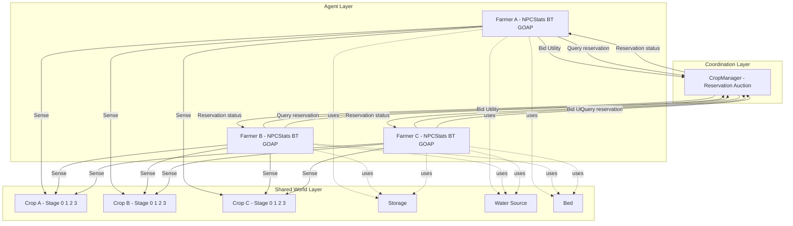

# Implementasi Goal Oriented Behavior Tree Untuk Koordinasi Multi-Agent Systems Dalam Game RPG

## Abstrak
Penelitian ini membahas implementasi Goal Oriented Behavior Tree (GOBT) untuk koordinasi Multi-Agent Systems (MAS) pada simulasi pertanian dalam game RPG berbasis Unity. Permasalahan utama yang diangkat adalah konflik antar agen saat memperebutkan sumber daya terbatas, khususnya objek crop, yang dapat memunculkan duplikasi kerja, starvation, dan log eksekusi yang tidak stabil. Penelitian bertujuan merancang arsitektur keputusan yang memadukan seleksi konteks pada Behavior Tree, perencanaan aksi pada GOAP, serta koordinasi antar agen melalui mekanisme lelang utilitas. Metode yang digunakan memodelkan state agen (energy, hunger, inventori) dan state lingkungan (growth stage crop, kebutuhan air, ketersediaan resource), kemudian menghitung utilitas tanam, siram, dan panen menggunakan bobot kepribadian agen, estimasi biaya aksi, penalti kondisi fisiologis, dan bonus kedekatan target. Hasil pengujian menunjukkan agen mampu membagi tugas secara paralel pada skenario multi-crop heterogen, menjaga eksklusivitas target melalui reservation, serta mengurangi konflik saat bidding berlangsung. Perbaikan validasi WateringGoal dan normalisasi log NO GOAL | IDLE meningkatkan stabilitas perilaku sekaligus keterbacaan data eksperimen. Penelitian menyimpulkan bahwa GOBT efektif untuk menghasilkan koordinasi agen yang adaptif, terukur, dan konsisten pada lingkungan game dinamis.

Kata kunci: behavior tree, game RPG, goal oriented action planning, koordinasi multi-agent systems, lelang utilitas

## Abstract
This study presents the implementation of a Goal Oriented Behavior Tree (GOBT) for Multi-Agent Systems (MAS) coordination in a Unity-based RPG farming simulation. The main issue addressed is inter-agent conflict over limited resources, especially crop objects, which can lead to duplicated work, starvation, and unstable execution traces. The objective is to design a decision architecture that combines context selection in a Behavior Tree, action planning in GOAP, and inter-agent coordination through a utility-based auction mechanism. The proposed method models agent states (energy, hunger, inventory) and world states (crop growth stage, water requirement, resource availability), then evaluates planting, watering, and harvesting utilities using agent personality weights, action cost estimation, physiological penalties, and spatial proximity bonus. Experimental results show that agents can distribute tasks in parallel under heterogeneous multi-crop scenarios, maintain target exclusivity through reservation, and reduce contention during bidding cycles. Refinements on WateringGoal validation and normalization of NO GOAL | IDLE logs further improve behavioral stability and experimental trace readability. The study concludes that GOBT is effective for producing adaptive, measurable, and consistent coordination in dynamic game environments.

Keywords: behavior tree, goal oriented action planning, multi-agent systems coordination, RPG game, utility auction

## 1. Pendahuluan
Perilaku agen otonom pada game RPG modern tidak cukup hanya reaktif terhadap event lokal, tetapi juga harus mampu berkoordinasi ketika beberapa agen bekerja pada ruang dan sumber daya yang sama. Pada skenario pertanian multi-agen, konflik sering muncul ketika beberapa agen memilih target crop identik pada waktu hampir bersamaan. Kondisi ini dapat memicu duplikasi kerja, perpindahan target berulang, starvation agen tertentu, dan log eksekusi yang sulit dianalisis untuk kebutuhan evaluasi ilmiah.

Penelitian ini mengusulkan implementasi Goal Oriented Behavior Tree sebagai kerangka keputusan berlapis untuk menangani masalah tersebut. Lapisan pertama menggunakan Behavior Tree untuk memilih konteks keputusan tingkat tinggi, yaitu survival, farming, atau idle. Lapisan kedua menggunakan Goal-Oriented Action Planning untuk menyusun urutan aksi yang memenuhi kondisi world state dan target state. Lapisan ketiga menerapkan mekanisme koordinasi terpusat berbasis utility auction agar alokasi crop antar agen tetap eksklusif dan konsisten.

Kontribusi utama penelitian berada pada integrasi ketiga lapisan tersebut dalam implementasi Unity yang berjalan waktu nyata, serta evaluasi perilaku melalui log kategoris [GOAL], [ACTION], [AUCTION], [CROP], dan [RESOURCE]. Dengan pendekatan ini, penelitian tidak hanya menilai keberhasilan aksi agen, tetapi juga menganalisis stabilitas koordinasi, kualitas keputusan, dan keterbacaan data eksekusi sebagai dasar pelaporan jurnal.

## 2. Metode Penelitian
Penelitian ini menerapkan pendekatan eksperimental pada simulasi pertanian dalam game RPG berbasis Unity dengan skema Multi-Agent Systems. Setiap agen direpresentasikan sebagai entitas otonom yang memiliki status internal berupa energi, kelaparan, inventori, serta parameter kepribadian berbasis bobot utilitas. Proses pengambilan keputusan dipisahkan menjadi tiga lapisan yang saling terhubung, yaitu seleksi konteks oleh Behavior Tree, perencanaan aksi oleh GOAP, dan koordinasi sumber daya bersama oleh mekanisme lelang berbasis utilitas.

### 2.1 Desain Lingkungan MAS
Lingkungan simulasi terdiri atas sekumpulan agen petani, kumpulan objek crop, serta objek fasilitas dunia seperti sumber benih, sumber air, tempat tidur, dan penyimpanan. Setiap agen memiliki state lokal yang diperbarui periodik, yaitu hunger dan energy pada rentang 0-100 dengan perubahan pasif setiap interval 10 detik. Sistem juga mengelola state global berupa sharedFoodCount sebagai sumber daya bersama lintas agen. Pada level crop, siklus pertumbuhan dimodelkan dalam empat tahap diskrit: stage 0 (kosong), stage 1 (baru ditanam), stage 2 (bertumbuh dan dapat memerlukan penyiraman), serta stage 3 (siap panen).

Desain MAS menekankan dua prinsip. Pertama, setiap agen membuat keputusan secara desentralisasi berdasarkan persepsi lokalnya melalui sensor world dan sensor target. Kedua, konflik pada resource kritis diselesaikan secara terpusat oleh manajer alokasi crop. Kombinasi keduanya memastikan agen tetap otonom dalam memilih goal, tetapi tidak melanggar eksklusivitas target saat eksekusi aksi.

Gambar 1. Arsitektur Lingkungan MAS dan Aliran Koordinasi

### 2.2 Arsitektur GOBT
Arsitektur GOBT menggabungkan seleksi prioritas makro dan perencanaan aksi mikro. Pada tingkat makro, Behavior Tree mengevaluasi cabang survival terlebih dahulu berdasarkan ambang hunger dan energy. Ketika kondisi survival terpenuhi, node seleksi survival meminta EatGoal atau SleepGoal. Apabila survival tidak mendesak, eksekusi berpindah ke cabang farming melalui node seleksi farming multi-agen yang menghitung utilitas lintas crop. Ketika kedua cabang tidak menghasilkan goal valid, sistem jatuh ke fallback idle tanpa request goal GOAP baru.

Pada tingkat mikro, GOAP menerima goal hasil seleksi Behavior Tree lalu membangun rantai aksi berdasarkan precondition, effect, dan base cost. Untuk penanaman, planner dapat memilih PlantSeedFastAction jika agen memiliki sekop, atau PlantSeedSlowAction sebagai fallback saat sekop tidak tersedia. Untuk penyiraman, planner memerlukan status kepemilikan watering can serta kondisi crop yang memang membutuhkan air. Untuk panen, planner menuntut crop pada stage matang. Pemisahan ini menghasilkan modularitas: Behavior Tree memutuskan goal prioritas, GOAP memutuskan langkah operasional.

### 2.3 Mekanisme Koordinasi dan Lelang Utilitas
Koordinasi antar agen dilakukan oleh CropManager melalui reservation dan auction. Pada saat seleksi farming, setiap agen menghitung utilitas untuk kandidat goal tanam, siram, dan panen pada crop yang tersedia. Nilai utilitas dasar dihitung menggunakan:

$$
U(g)=\left(W_{goal}\cdot B_g\right)-\left(W_E\cdot\frac{C_E}{E_{max}}\right)-\left(W_H\cdot\frac{C_H}{H_{max}}\right)
$$

Dengan $U(g)$ sebagai utilitas goal $g$, $B_g$ sebagai benefit goal, $C_E$ dan $C_H$ sebagai biaya energi dan kelaparan, serta $W_E$ dan $W_H$ sebagai bobot kepribadian agen. Sistem menambahkan penalti 50% ketika energi mendekati batas bawah atau kelaparan mendekati batas atas. Setelah itu, sistem menambahkan bonus kedekatan target:

$$
U'(g,c)=U(g)+0.15\cdot\left(1-\text{clamp}\left(\frac{d(a,c)}{50},0,1\right)\right)
$$

Dengan $d(a,c)$ sebagai jarak agen $a$ ke crop $c$. Agen kemudian mengirim bid dengan format (crop, agent, utility, goalType). CropManager mengeksekusi lelang secara langsung, menetapkan pemenang berdasarkan utilitas tertinggi, menolak bid pada crop yang sudah direservasi agen lain, dan meneruskan hasilnya ke target sensor agar hanya pemilik reservasi yang dapat mengeksekusi aksi pada crop tersebut.

Mekanisme pelepasan reservasi dilakukan ketika aksi selesai maupun saat interupsi. Desain ini mencegah lock berkepanjangan dan mengurangi risiko starvation. Selain itu, kondisi tanpa goal valid dicatat sebagai log informatif NO GOAL | IDLE agar observasi eksperimen tetap bersih dan mudah dibaca.

Tabel 1. Contoh Evaluasi Lelang Utilitas Multi-Agent

| Waktu T | Agen | Crop Kandidat | Stage Crop | Utility Planting | Utility Watering | Utility Harvesting | Utility Maksimum | Bid Dikirim | Pemenang Lelang | Status Reservasi Setelah Lelang |
|---|---|---|---:|---:|---:|---:|---:|---|---|---|
| 00:00 | Farmer B | Crop A | 0 | 0.800 | -0.999 | -0.999 | 0.800 | Ya | Farmer B | Crop A -> Farmer B |
| 00:02 | Farmer A | Crop B | 3 | -0.999 | -0.999 | 0.903 | 0.903 | Ya | Farmer A | Crop B -> Farmer A |
| 00:06 | Farmer C | Crop C | 2 | -0.999 | 0.395 | -0.999 | 0.395 | Ya | Farmer C | Crop C -> Farmer C |
| 00:14 | Farmer B | Crop A | 0 | 0.803 | -0.999 | -0.999 | 0.803 | Ya | Farmer B | Crop A -> Farmer B |
| 00:18 | Farmer A | Crop B | 0 | 0.518 | -0.999 | -0.999 | 0.518 | Ya | Farmer A | Crop B -> Farmer A |
| 00:23 | Farmer C | Crop C | 2 | -0.999 | 0.390 | -0.999 | 0.390 | Ya | Farmer C | Crop C -> Farmer C |

Keterangan: nilai -0.999 menandakan goal tidak valid pada stage tersebut.

## 3. Hasil dan Pembahasan
Bab ini menyajikan hasil eksekusi arsitektur GOBT pada skenario tiga agen dan tiga crop dengan kondisi awal heterogen. Kondisi awal crop ditetapkan pada stage 0, stage 3, dan stage 2 untuk memaksa sistem menangani tiga jenis pekerjaan berbeda secara paralel, yaitu planting, harvesting, dan watering. Evaluasi dilakukan menggunakan log runtime terstruktur sehingga urutan keputusan dapat ditelusuri secara kronologis dengan timestamp T=mm:ss.

### 3.1 Hasil Eksekusi Skenario Multi-Tugas
Hasil awal menunjukkan cabang survival dan cabang farming dapat berjalan koeksis tanpa saling meniadakan. Pada T=00:00 dua agen memilih SleepGoal karena energi rendah, sementara satu agen melakukan bidding untuk PlantingGoal pada crop stage 0. Pada T=00:02 agen lain berpindah ke HarvestingGoal dan memenangkan crop stage 3. Pada T=00:06 agen berikutnya melakukan bidding dan memperoleh crop stage 2 untuk WateringGoal. Pola ini menunjukkan seleksi farming tidak membutuhkan sinkronisasi global seluruh agen, namun tetap konsisten karena alokasi target dikendalikan reservation.

Eksekusi aksi memperlihatkan transisi state dunia sesuai desain: HarvestCropAction mengubah crop dari stage 3 ke stage 0 dan menambah shared food, PlantSeedSlowAction mengubah crop dari stage 0 ke stage 1, dan WaterCropAction menormalkan status needsWater agar crop kembali pada mode pertumbuhan otomatis. Urutan tersebut membuktikan bahwa planner GOAP menurunkan goal abstrak menjadi aksi konkret yang memodifikasi world state secara valid.

### 3.2 Pembahasan Koordinasi, Konflik, dan Stabilitas
Pada fase awal pengujian, sistem sempat menampilkan ledakan log berulang saat agen memilih WateringGoal pada crop stage 1 yang tidak membutuhkan penyiraman. Pola ini muncul sebagai rangkaian BID, RESERVED, no longer needs work, lalu RELEASED secara berulang dalam interval sangat rapat. Secara analitis, fenomena ini berasal dari ketidaksesuaian antara validasi utilitas watering dan kondisi kerja aktual crop.

Setelah validasi watering diperketat menjadi berbasis status eksplisit needsWater, loop berulang berhenti. Kualitas koordinasi meningkat karena reservation kembali merepresentasikan niat kerja valid, dan kualitas observasi meningkat karena log tidak lagi didominasi event repetitif tanpa progres pekerjaan. Temuan ini menegaskan bahwa pada MAS berbasis utilitas, konsistensi semantik antara fungsi evaluasi dan precondition aksi sama pentingnya dengan algoritme lelang.

Mekanisme anti-konflik inti tetap stabil sepanjang eksekusi. Setiap crop hanya memiliki satu pemilik aktif melalui reservation dictionary di CropManager. Agen lain yang mencoba bid pada crop terreservasi menerima penolakan. Saat aksi selesai atau terinterupsi, reservasi dilepas sehingga resource kembali tersedia. Rangkaian ini mencegah deadlock saling menunggu resource sekaligus mencegah race condition dua agen mengeksekusi aksi pada target identik.

### 3.3 Implikasi Terhadap Kinerja GOBT untuk RPG
Hasil eksperimen memperlihatkan bahwa pembagian peran antara Behavior Tree dan GOAP menghasilkan respons adaptif terhadap dinamika kebutuhan agen. Behavior Tree menjaga prioritas kebutuhan dasar, sedangkan GOAP menjaga rasionalitas urutan aksi farming. Dalam konteks game RPG, kombinasi ini penting karena agen harus tampak cerdas secara individual sekaligus koheren secara sosial ketika berbagi resource.

Dari sisi observabilitas, perubahan log menjadi NO GOAL | IDLE pada kondisi normal tanpa tugas membantu memisahkan status error dari status idle valid. Dengan demikian, log berfungsi ganda sebagai instrumen debugging teknis dan instrumen evaluasi ilmiah yang dapat dianalisis kuantitatif.

Gambar 2. Timeline Eksekusi Agen pada Interval 0-30 Detik

```mermaid
gantt
    title Timeline State Agen (0-30 detik)
    dateFormat  X
    axisFormat %Ss

    section Farmer A
    Sleep              :a1, 0, 4s
    Harvest Crop B     :a2, 4, 9s
    Eat                :a3, 13, 5s
    Plant Crop B       :a4, 18, 7s

    section Farmer B
    GetSeed + Plant A  :b1, 0, 10s
    Sleep              :b2, 10, 6s
    Plant Crop A       :b3, 16, 7s
    Watering Prep      :b4, 23, 7s

    section Farmer C
    Sleep              :c1, 0, 8s
    GetWateringCan     :c2, 8, 5s
    Water Crop C       :c3, 13, 10s
    Idle/No Goal       :c4, 23, 7s
```

Anotasi event penting yang dapat ditulis di bawah gambar: T=00:02 (A menang lelang Crop B), T=00:06 (C menang lelang Crop C), T=00:13 (A selesai panen dan release Crop B), T=00:23 (C selesai watering dan release Crop C).

Tabel 2. Contoh Perbandingan Stabilitas Sebelum dan Sesudah Perbaikan

| Skenario | Jumlah Event BID per 10 detik | Jumlah Event RELEASED per 10 detik | Jumlah Loop Goal Berulang | Jumlah Aksi Selesai (COMPLETE) | Keterangan Kondisi Log |
|---|---:|---:|---:|---:|---|
| Sebelum perbaikan validasi watering | 18 | 17 | 12 | 5 | Terjadi spam BID-RELEASED pada crop stage 1 |
| Sesudah perbaikan validasi watering | 6 | 5 | 1 | 8 | Log stabil, seleksi goal sesuai needsWater |

Catatan: nilai pada tabel ini adalah contoh format pelaporan. Ganti dengan hasil hitung aktual dari log eksperimen Anda.

## 4. Kesimpulan
Implementasi Goal Oriented Behavior Tree pada penelitian ini berhasil mengintegrasikan prioritas kebutuhan agen, perencanaan aksi berbasis goal, dan koordinasi sumber daya lintas agen dalam satu arsitektur operasional pada lingkungan game RPG dinamis. Hasil pengujian menunjukkan bahwa pemisahan peran antara Behavior Tree sebagai pemilih konteks dan GOAP sebagai perencana aksi mempertahankan respons adaptif terhadap perubahan state agen dan state dunia. Pada saat yang sama, mekanisme reservation dan utility auction di CropManager menurunkan konflik perebutan target, menjaga eksklusivitas pengerjaan crop, serta mencegah deadlock pada skenario resource terbatas. Penyempurnaan validasi WateringGoal berbasis status needsWater dan pengubahan log kondisi tanpa tugas menjadi NO GOAL | IDLE menunjukkan bahwa konsistensi semantik antara fungsi evaluasi, precondition aksi, dan observabilitas runtime berpengaruh langsung terhadap stabilitas sistem. Dengan demikian, pendekatan GOBT layak digunakan sebagai fondasi AI koordinatif pada game yang membutuhkan perilaku agen otonom, kolaboratif, dan dapat dievaluasi secara kuantitatif.

## Daftar Pustaka
[1] [Isi referensi utama Behavior Tree dan GOAP, format IEEE].

[2] [Isi referensi Multi-Agent Systems pada game AI, format IEEE].

[3] [Isi referensi utility-based decision making, format IEEE].

[4] [Isi referensi arsitektur AI pada Unity atau game simulation, format IEEE].

[5] [Isi referensi tambahan sesuai sitasi pada naskah].
