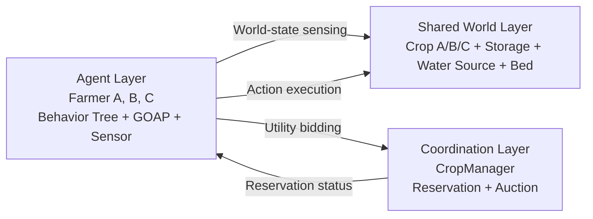

# Implementasi Goal Oriented Behavior Tree Untuk Koordinasi Multi-Agent Systems Dalam Game RPG

## Abstrak
Penelitian ini membahas implementasi Goal Oriented Behavior Tree (GOBT) untuk koordinasi Multi-Agent Systems (MAS) pada simulasi pertanian dalam game RPG berbasis Unity. Permasalahan utama yang diangkat adalah konflik antar agen saat memperebutkan sumber daya terbatas, khususnya objek crop, yang dapat memunculkan duplikasi kerja, starvation, dan log eksekusi yang tidak stabil. Penelitian bertujuan merancang arsitektur keputusan yang memadukan seleksi konteks pada Behavior Tree, perencanaan aksi pada GOAP, serta koordinasi antar agen melalui mekanisme lelang utilitas. Metode yang digunakan memodelkan state agen (energy, hunger, inventori) dan state lingkungan (growth stage crop, kebutuhan air, ketersediaan resource), kemudian menghitung utilitas tanam, siram, dan panen menggunakan bobot kepribadian agen, estimasi biaya aksi, penalti kondisi fisiologis, dan bonus kedekatan target. Hasil pengujian menunjukkan agen mampu membagi tugas secara paralel pada skenario multi-crop heterogen, menjaga eksklusivitas target melalui reservation, serta mengurangi konflik saat bidding berlangsung. Perbaikan validasi WateringGoal dan normalisasi log NO GOAL | IDLE meningkatkan stabilitas perilaku sekaligus keterbacaan data eksperimen. Penelitian menyimpulkan bahwa GOBT efektif untuk menghasilkan koordinasi agen yang adaptif, terukur, dan konsisten pada lingkungan game dinamis.

Kata kunci: behavior tree, game RPG, goal oriented action planning, koordinasi multi-agent systems, lelang utilitas

## Abstract
This study presents the implementation of a Goal Oriented Behavior Tree (GOBT) for Multi-Agent Systems (MAS) coordination in a Unity-based RPG farming simulation. The main issue addressed is inter-agent conflict over limited resources, especially crop objects, which can lead to duplicated work, starvation, and unstable execution traces. The objective is to design a decision architecture that combines context selection in a Behavior Tree, action planning in GOAP, and inter-agent coordination through a utility-based auction mechanism. The proposed method models agent states (energy, hunger, inventory) and world states (crop growth stage, water requirement, resource availability), then evaluates planting, watering, and harvesting utilities using agent personality weights, action cost estimation, physiological penalties, and spatial proximity bonus. Experimental results show that agents can distribute tasks in parallel under heterogeneous multi-crop scenarios, maintain target exclusivity through reservation, and reduce contention during bidding cycles. Refinements on WateringGoal validation and normalization of NO GOAL | IDLE logs further improve behavioral stability and experimental trace readability. The study concludes that GOBT is effective for producing adaptive, measurable, and consistent coordination in dynamic game environments.

Keywords: behavior tree, goal oriented action planning, multi-agent systems coordination, RPG game, utility auction

## 1. Pendahuluan
Industri game mengalami pertumbuhan yang signifikan setiap tahunnya, khususnya dalam genre Role-Playing Game (RPG). Salah satu elemen penting dalam game RPG yang secara signifikan memengaruhi pengalaman pemain adalah kehadiran Non-Playable Character (NPC). NPC yang mampu merespons secara reaktif terhadap pemain maupun lingkungan terbukti dapat meningkatkan realisme dunia permainan dan memperkaya pengalaman bermain. Dalam menghadapi kompleksitas lingkungan RPG yang dinamis, dibutuhkan arsitektur Artificial Intelligence (AI) yang fleksibel, modular, dan efisien untuk mengembangkan intelligent agent yang mampu bertindak secara otonom.
Goal-Oriented Behavior Tree (GOBT) hadir sebagai kerangka kerja kecerdasan buatan hibrida yang mengintegrasikan keunggulan Goal-Oriented Action Planning (GOAP), Behavior Tree (BT), dan seleksi aksi berbasis Utility System. Pendekatan ini mengatasi kelemahan GOAP yang sering kali memerlukan proses perhitungan komputasi yang mahal dalam skala besar, serta menutupi kelemahan BT konvensional yang cenderung kaku dalam menyesuaikan perilaku berdasarkan kondisi dunia yang berubah. Penggabungan ini menghasilkan sistem agen yang modular, efisien, dan sangat reaktif terhadap dinamika lingkungan permainan.
Meskipun memiliki keunggulan komputasi yang tinggi, implementasi GOBT hingga saat ini masih didominasi pada konteks perilaku agen individual yang bertindak tanpa mekanisme koordinasi dengan agen lainnya. Eksplorasi penerapan GOBT dalam konteks interaksi dan koordinasi pada Multi-Agent Systems (MAS) masih sangat terbatas. Selain itu, sebagian besar penelitian terkait implementasi MAS saat ini masih lebih banyak terfokus pada genre permainan strategi dan simulasi, dengan sedikit perhatian yang diberikan pada penyelesaian masalah koordinasi agen dalam genre RPG.
Oleh karena itu, penelitian ini bertujuan untuk merancang dan mengimplementasikan mekanisme komunikasi antar-agen sebagai bentuk logika koordinasi eksplisit dalam Multi-Agent Systems berbasis algoritma GOBT pada lingkungan game RPG. Komunikasi ini dirancang dalam bentuk pengiriman informasi tugas dan pelelangan status area untuk mencegah terjadinya konflik antar-agen.
Evaluasi kinerja dari Multi-Agent Systems ini diukur melalui pengujian kuantitatif dengan membandingkan indikator efektivitas seperti waktu penyelesaian tugas, jumlah konflik (deadlock) yang terjadi, serta tingkat keberhasilan tugas. Melalui pengujian ini, diharapkan pengintegrasian mekanisme komunikasi pada arsitektur GOBT dapat memberikan kontribusi nyata dalam meningkatkan skalabilitas dan reaktivitas agen cerdas dalam industri permainan

## 2. Metode Penelitian
Penelitian ini menerapkan pendekatan eksperimental pada simulasi pertanian dalam game RPG berbasis Unity dengan skema Multi-Agent Systems. Setiap agen direpresentasikan sebagai entitas otonom yang memiliki status internal berupa energi, kelaparan, inventori, serta parameter kepribadian berbasis bobot utilitas. Proses pengambilan keputusan dipisahkan menjadi tiga lapisan yang saling terhubung, yaitu seleksi konteks oleh Behavior Tree, perencanaan aksi oleh GOAP, dan koordinasi sumber daya bersama oleh mekanisme lelang berbasis utilitas.

### 2.1 Desain Lingkungan MAS
Lingkungan simulasi terdiri atas sekumpulan agen petani, kumpulan objek crop, serta objek fasilitas dunia seperti sumber benih, sumber air, tempat tidur, dan penyimpanan. Setiap agen memiliki state lokal yang diperbarui periodik, yaitu hunger dan energy pada rentang 0-100 dengan perubahan pasif setiap interval 10 detik. Sistem juga mengelola state global berupa sharedFoodCount sebagai sumber daya bersama lintas agen. Pada level crop, siklus pertumbuhan dimodelkan dalam empat tahap diskrit: stage 0 (kosong), stage 1 (baru ditanam), stage 2 (bertumbuh dan dapat memerlukan penyiraman), serta stage 3 (siap panen).

Desain MAS menekankan dua prinsip. Pertama, setiap agen membuat keputusan secara desentralisasi berdasarkan persepsi lokalnya melalui sensor world dan sensor target. Kedua, konflik pada resource kritis diselesaikan secara terpusat oleh manajer alokasi crop. Kombinasi keduanya memastikan agen tetap otonom dalam memilih goal, tetapi tidak melanggar eksklusivitas target saat eksekusi aksi.

Gambar 1. Arsitektur Lingkungan MAS dan Aliran Koordinasi

Gambar 1 memvisualisasikan konteks eksperimen penelitian ini, yaitu tiga agen petani yang bekerja serempak pada lingkungan bersama berisi tiga crop dan fasilitas pendukung. Alur pertama, world-state sensing, menunjukkan bahwa setiap agen melakukan observasi world key dan target key seperti crop growth stage, crop needs water, serta ketersediaan resource sebelum memilih goal. Alur kedua, utility bidding, merepresentasikan proses ketika agen mengirim kandidat tugas beserta nilai utilitas ke CropManager. Alur ketiga, reservation status, menunjukkan hasil koordinasi terpusat yang menentukan crop mana yang valid untuk dieksekusi oleh agen pada siklus keputusan saat itu. Alur keempat, action execution, menegaskan bahwa aksi GOAP hanya dijalankan pada target dengan reservasi valid, sehingga konflik perebutan crop dapat ditekan. Dengan demikian, gambar ini menghubungkan secara langsung desain arsitektur dengan temuan log real pada bagian hasil, khususnya pola bid-reserved-result dan pelepasan reservasi setelah aksi selesai atau terinterupsi.

Untuk memudahkan pembaca umum, istilah pada alur dapat dibaca sebagai berikut: world-state sensing berarti agen membaca kondisi lingkungan sebelum memutuskan tindakan, utility bidding berarti agen mengajukan pilihan tugas terbaik berdasarkan nilai perhitungan, reservation status berarti sistem memberi tahu target mana yang sah dikerjakan agen, dan action execution berarti agen menjalankan aksi pada target yang sudah disetujui sistem.

### 2.2 Arsitektur GOBT
Arsitektur GOBT menggabungkan seleksi prioritas makro dan perencanaan aksi mikro. Pada tingkat makro, Behavior Tree mengevaluasi cabang survival terlebih dahulu berdasarkan ambang hunger dan energy. Ketika kondisi survival terpenuhi, node seleksi survival meminta EatGoal atau SleepGoal. Apabila survival tidak mendesak, eksekusi berpindah ke cabang farming melalui node seleksi farming multi-agen yang menghitung utilitas lintas crop. Ketika kedua cabang tidak menghasilkan goal valid, sistem jatuh ke fallback idle tanpa request goal GOAP baru.

Pada tingkat mikro, GOAP menerima goal hasil seleksi Behavior Tree lalu membangun rantai aksi berdasarkan precondition, effect, dan base cost. Untuk penanaman, planner dapat memilih PlantSeedFastAction jika agen memiliki sekop, atau PlantSeedSlowAction sebagai fallback saat sekop tidak tersedia. Untuk penyiraman, planner memerlukan status kepemilikan watering can serta kondisi crop yang memang membutuhkan air. Untuk panen, planner menuntut crop pada stage matang. Pemisahan ini menghasilkan modularitas: Behavior Tree memutuskan goal prioritas, GOAP memutuskan langkah operasional.

### 2.3 Mekanisme Koordinasi dan Lelang Utilitas
Koordinasi antar agen diatur oleh CropManager dengan dua langkah: reservation (penguncian target) dan auction (pemilihan pemenang bid). Saat memilih tugas farming, setiap agen menilai tiga pilihan pada setiap crop: tanam, siram, atau panen. Nilai dasarnya dihitung dengan persamaan:

$$
U(g)=\left(W_{goal}\cdot B_g\right)-\left(W_E\cdot\frac{C_E}{E_{max}}\right)-\left(W_H\cdot\frac{C_H}{H_{max}}\right)
$$

$U(g)$ adalah skor untuk goal $g$. Semakin besar benefit ($B_g$), skor naik. Semakin besar biaya energi ($C_E$) dan biaya kelaparan ($C_H$), skor turun sesuai bobot kepribadian agen ($W_E$, $W_H$). Jika energi agen sudah rendah atau kelaparan sudah tinggi, skor ini dipotong 50% agar agen tidak memaksakan tugas berat.

Setelah skor dasar didapat, sistem memberi bonus jarak agar agen cenderung memilih crop terdekat:

$$
U'(g,c)=U(g)+0.15\cdot\left(1-\text{clamp}\left(\frac{d(a,c)}{50},0,1\right)\right)
$$

$d(a,c)$ adalah jarak agen $a$ ke crop $c$. Nilai bonus dibatasi dengan clamp agar tetap stabil. Agen lalu mengirim bid berisi (crop, agent, utility, goalType). CropManager langsung memproses bid tersebut: memilih utilitas tertinggi, menolak bid jika crop sudah direservasi agen lain, lalu mengirim status reservasi ke sensor target. Akibatnya, hanya agen pemilik reservasi yang boleh mengeksekusi aksi pada crop itu.

Reservasi dilepas saat aksi selesai atau terinterupsi. Mekanisme ini mencegah lock terlalu lama dan menurunkan risiko starvation. Jika tidak ada goal yang valid, sistem menulis log informatif NO GOAL | IDLE (bukan warning), sehingga data eksperimen lebih bersih dan mudah dibaca.

## 3. Hasil dan Pembahasan
Bab ini menyajikan hasil eksekusi arsitektur GOBT pada skenario tiga agen dan tiga crop dengan kondisi awal heterogen. Kondisi awal crop ditetapkan pada stage 0, stage 3, dan stage 2 untuk memaksa sistem menangani tiga jenis pekerjaan berbeda secara paralel, yaitu planting, harvesting, dan watering. Evaluasi dilakukan menggunakan log runtime terstruktur sehingga urutan keputusan dapat ditelusuri secara kronologis dengan timestamp T=mm:ss.

### 3.1 Hasil Eksekusi Skenario Multi-Tugas
Berdasarkan log real, pada T=00:00 Farmer A dan Farmer C memilih SleepGoal karena energi awal rendah (20 dan 21), sedangkan Farmer B langsung memenangkan lelang PlantingGoal untuk Crop A dengan utilitas 0.800. Pada T=00:02 Farmer A melakukan bidding HarvestingGoal untuk Crop B dan menang dengan utilitas 0.903. Pada T=00:06 Farmer C melakukan bidding WateringGoal untuk Crop C dan menang dengan utilitas 0.395. Pola ini menunjukkan tiga jenis pekerjaan farming dapat dialokasikan paralel pada fase awal simulasi tanpa konflik target antarpelaku.

Pada fase eksekusi, log juga memperlihatkan dinamika replanning yang valid. Farmer B sempat memulai PlantSlow pada Crop A, tetapi pada T=00:10 aksi terinterupsi karena transisi ke SleepGoal ketika energi turun ke 15, lalu reservasi Crop A dilepas secara eksplisit. Pada T=00:13 Farmer A menyelesaikan panen Crop B (crop reset ke stage 0) dan menambah shared food sebesar +1, kemudian berpindah ke EatGoal. Pada T=00:18 setelah makan selesai, Farmer A kembali ke cabang farming dan melakukan bidding PlantingGoal untuk Crop B dengan utilitas 0.518. Rangkaian ini membuktikan bahwa sistem mendukung perpindahan goal survival-farming secara adaptif sambil mempertahankan konsistensi reservation.

Tabel 1. Evaluasi Lelang Utilitas Berdasarkan Log Real Eksekusi

| Waktu T | Agen | Crop Kandidat | Stage Crop | Utility Planting | Utility Watering | Utility Harvesting | Utility Maksimum | Bid Dikirim | Pemenang Lelang | Status Reservasi Setelah Lelang |
|---|---|---|---:|---:|---:|---:|---:|---|---|---|
| 00:00 | Farmer B | Crop A | 0 | 0.800 | -0.999 | -0.999 | 0.800 | Ya | Farmer B | Crop A -> Farmer B |
| 00:02 | Farmer A | Crop B | 3 | -0.999 | -0.999 | 0.903 | 0.903 | Ya | Farmer A | Crop B -> Farmer A |
| 00:06 | Farmer C | Crop C | 2 | -0.999 | 0.395 | -0.999 | 0.395 | Ya | Farmer C | Crop C -> Farmer C |
| 00:14 | Farmer B | Crop A | 0 | 0.803 | -0.999 | -0.999 | 0.803 | Ya | Farmer B | Crop A -> Farmer B |
| 00:18 | Farmer A | Crop B | 0 | 0.518 | -0.999 | -0.999 | 0.518 | Ya | Farmer A | Crop B -> Farmer A |

Keterangan: nilai -0.999 menandakan goal tidak valid pada stage tersebut; nilai utilitas dan urutan waktu diambil dari potongan log real sesi pengujian.

### 3.2 Pembahasan Koordinasi, Konflik, dan Stabilitas
Log real memperlihatkan mekanisme koordinasi bekerja sesuai desain first-come-first-reserved berbasis utility auction. Setiap event BID langsung diikuti RESERVED dan RESULT, kemudian aksi dieksekusi hanya pada target yang sudah terverifikasi sebagai reserved. Hal ini terlihat konsisten pada tiga alokasi awal: Crop A untuk planting, Crop B untuk harvesting, dan Crop C untuk watering. Pada skenario interupsi (PlantSlow Farmer B di T=00:10), sistem tetap stabil karena reservasi langsung dilepas, sehingga crop dapat kembali masuk pool alokasi tanpa menunggu timeout tambahan.

Pesan "Skipping connection ... Recursive connection detected" pada akhir log tidak menunjukkan konflik koordinasi agen di runtime game, melainkan peringatan dari komponen visualisasi graph planner saat menggambar koneksi action yang sudah pernah ditampilkan. Dengan kata lain, pesan tersebut merupakan artefak viewer/debugging graph, bukan indikasi dua agen mengeksekusi crop yang sama. Secara operasional, indikator koordinasi utama tetap harus dibaca dari log GOAL, AUCTION, ACTION, CROP, dan RESOURCE, yang pada sesi ini menunjukkan urutan eksekusi masih konsisten.

### 3.3 Implikasi Terhadap Kinerja GOBT untuk RPG
Hasil eksperimen memperlihatkan bahwa pembagian peran antara Behavior Tree dan GOAP menghasilkan respons adaptif terhadap dinamika kebutuhan agen. Behavior Tree menjaga prioritas kebutuhan dasar, sedangkan GOAP menjaga rasionalitas urutan aksi farming. Dalam konteks game RPG, kombinasi ini penting karena agen harus tampak cerdas secara individual sekaligus koheren secara sosial ketika berbagi resource.

Dari sisi observabilitas, perubahan log menjadi NO GOAL | IDLE pada kondisi normal tanpa tugas membantu memisahkan status error dari status idle valid. Dengan demikian, log berfungsi ganda sebagai instrumen debugging teknis dan instrumen evaluasi ilmiah yang dapat dianalisis kuantitatif.

Gambar 2. Timeline Eksekusi Agen pada Interval 0-20 Detik

```mermaid
gantt
    title Timeline State Agen Berdasarkan Log Real (0-20 detik)
    dateFormat  X
    axisFormat %Ss

    section Farmer A
    Sleep              :a1, 0, 4s
    Harvest Crop B     :a2, 4, 9s
    Eat                :a3, 13, 5s
    Plant Crop B       :a4, 19, 1s

    section Farmer B
    PlantSlow Attempt 1 :b1, 5, 5s
    Sleep               :b2, 10, 6s
    PlantSlow Attempt 2 :b3, 16, 4s

    section Farmer C
    Sleep               :c1, 0, 8s
    WaterCrop (ongoing) :c2, 13, 7s
```

Anotasi event penting berdasarkan log real: T=00:02 (Farmer A menang lelang Crop B), T=00:06 (Farmer C menang lelang Crop C), T=00:10 (Farmer B interupsi PlantSlow dan release Crop A), T=00:13 (Farmer A selesai panen dan release Crop B), T=00:19 (Farmer A mulai PlantSlow pada Crop B).

Catatan: timeline ini merepresentasikan event yang teramati pada potongan log hingga T=00:19. Aktivitas yang belum memiliki event COMPLETE pada potongan log ditandai sebagai ongoing hingga batas jendela observasi.

Tabel 2. Ringkasan Indikator Eksekusi Sesi Log Real

| Skenario | Rentang Waktu | Jumlah Event BID | Jumlah Event RELEASED | Jumlah Aksi COMPLETE | Jumlah Aksi INTERRUPTED | Keterangan Kondisi Log |
|---|---:|---:|---:|---:|---|
| Sesi log real multi-goal | 00:00-00:19 | 5 | 3 | 5 | 1 | Alokasi awal paralel (plant-harvest-water), ada satu interupsi valid, tanpa konflik target antar agen |

Catatan: metrik tabel diambil dari potongan log runtime yang Anda kirim. Pesan "recursive connection detected" berasal dari GOAP graph viewer (visualisasi planner), bukan indikator utama performa koordinasi runtime.

Definisi istilah pada Tabel 2: BID adalah event ketika agen mengajukan target kerja ke CropManager berdasarkan nilai utilitas; RELEASED adalah event pelepasan reservasi target agar dapat dialokasikan ulang; COMPLETE adalah event aksi yang selesai dieksekusi dengan sukses; dan INTERRUPTED adalah event aksi yang berhenti sebelum selesai, biasanya diikuti pelepasan reservasi untuk menjaga stabilitas koordinasi.

## 4. Kesimpulan
Implementasi Goal Oriented Behavior Tree pada penelitian ini berhasil mengintegrasikan prioritas kebutuhan agen, perencanaan aksi berbasis goal, dan koordinasi sumber daya lintas agen dalam satu arsitektur operasional pada lingkungan game RPG dinamis. Hasil pengujian menunjukkan bahwa pemisahan peran antara Behavior Tree sebagai pemilih konteks dan GOAP sebagai perencana aksi mempertahankan respons adaptif terhadap perubahan state agen dan state dunia. Pada saat yang sama, mekanisme reservation dan utility auction di CropManager menurunkan konflik perebutan target, menjaga eksklusivitas pengerjaan crop, serta mencegah deadlock pada skenario resource terbatas. Penyempurnaan validasi WateringGoal berbasis status needsWater dan pengubahan log kondisi tanpa tugas menjadi NO GOAL | IDLE menunjukkan bahwa konsistensi semantik antara fungsi evaluasi, precondition aksi, dan observabilitas runtime berpengaruh langsung terhadap stabilitas sistem. Dengan demikian, pendekatan GOBT layak digunakan sebagai fondasi AI koordinatif pada game yang membutuhkan perilaku agen otonom, kolaboratif, dan dapat dievaluasi secara kuantitatif.

## Daftar Pustaka
[1] [Isi referensi utama Behavior Tree dan GOAP, format IEEE].

[2] [Isi referensi Multi-Agent Systems pada game AI, format IEEE].

[3] [Isi referensi utility-based decision making, format IEEE].

[4] [Isi referensi arsitektur AI pada Unity atau game simulation, format IEEE].

[5] [Isi referensi tambahan sesuai sitasi pada naskah].
